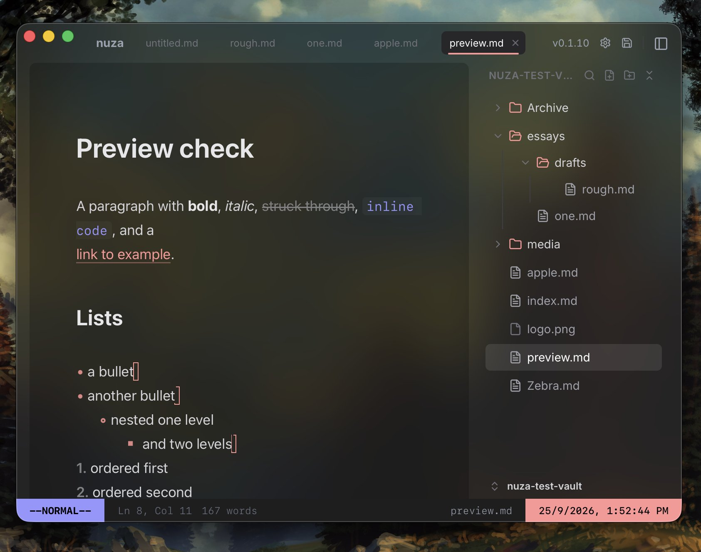

# nuza

**nuza** is a lightning-fast, privacy-first, and fully open-source alternative to Obsidian. Built natively with Tauri and React, it delivers a deeply integrated desktop experience that stays out of your way.



Featuring a beautifully minimalist UI, native Vim keybindings out of the box, and a strictly local file-system approach, **nuza** is designed for developers and writers who demand absolute control over their notes without the bloat.

## Local Setup

1. Clone the repository and navigate into the project directory.

2. Install dependencies:

   ```sh
   bun install
   ```

3. Run the development server:
   ```sh
   bun run tauri dev
   ```

## Build

To build the native application for your operating system:

```sh
bun run tauri build
```

## Contributing

If you're interested in contributing to nuza, please read our [contributing docs](CONTRIBUTING.md) before submitting a pull request.

## License

This project is licensed under the MIT License - see the [LICENSE](LICENSE) file for details.
